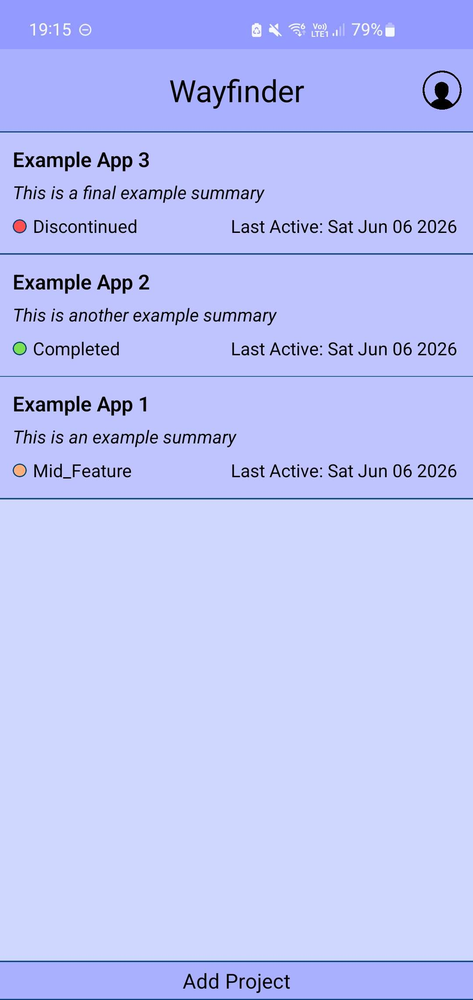
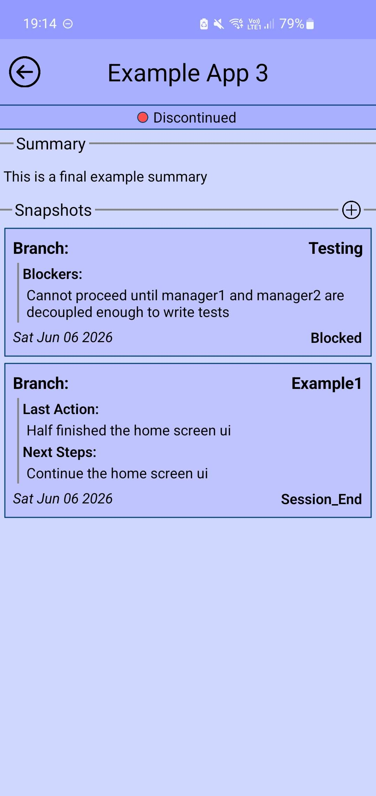

# Wayfinder

  
  

## Summary
A cross-platform mobile application built to aid in project tracking, directed toward developers. Wayfinder allows you to keep track of individual local git branches and surfaces useful information. This makes it easier to track current changes as well as helping users return back to their projects after a long hiatus, so they are not lost on what they were doing last and planning to do next.

## Tech Stack & Requirements
- [Wayfinder backend](https://github.com/RealDevJG/wayfinder-backend)
- Node.js
- Axios
- Expo
- React Native
- Zustand

## Features
- **Project listing:** have a full list of all of your projects, organised by most recently worked on.
- **Project Status:** track the status of your project as either
  - idea
  - resting
  - mid-feature
  - on-hold
  - completed
  - discontinued
- **Snapshots:** store information about specific git branches, such as what you did last, what you need to do next, what bugs need fixing, what research is required, and what blockers are preventing you from continuing work on this branch. Snapshots can be created and deleted at any point in time for any project.

## How to run the project
1. Run `npm install` in the root of the repository
2. Setup a .env file through expo's online panel to include `EXPO_PUBLIC_API_URI` pointing to the backend and `EXPO_PUBLIC_APP_ENV` set to either `prod`, `preview` or `dev`
3. Run `npm run start` and follow the instructions
4. Setup and run the [backend](https://github.com/RealDevJG/wayfinder-backend)

## Visuals
For any of these screens, you can long-press elements to bring up more options, such as edit, delete and more.

Home screen

      

The homepage lists all of your projects that you are currently working on. Each element lists its current status, title, description and when it was last changed. These views are clickable and will open the screen in the below collapsible.

Clicked-Project screen

      

This page allows you to edit the projects details, which helps you keep track of whatever you wish; Editing the summary is as simple as tapping it; clicking the header allows you to change the status and title of the project; clicking the + adds a new snapshot.  
The main way to track your project changes is to use snapshots. Snapshots allow you to track individual branches of your git repo; branch names are shown in the first line; the last line shows the date it was last changed and the session status; and the indented areas show a summary of what you need to know based on the session status. For example, the first snapshot shows the status as "Blocked". At a glance, you'd need to know why it is blocked, so the blockers section is visible from this menu. You can click into the snapshot for more information if required. The second snapshot shows session_end, which means the user working on this branch just stopped working on it for the day without any blockers or problems. The quick-read indents show the last action and next required steps, useful for picking up from where you left off even months prior. You may add as many snapshots as you need per project! There are plans to allow for archiving of individual snapshots.

